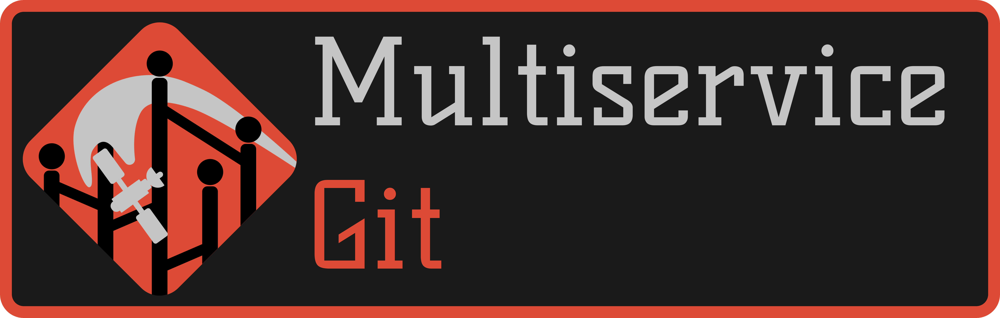

Enter in: [README-RU](./README-RU.md)

    

---

multiservice-git

# Python tools

**UI: [Flet](https://flet.dev/)**

**Flet** — Is a framework that enables you to easily build real-time web, mobile, and desktop apps in your favorite language and securely share them with your team. No frontend experience is required.

---

